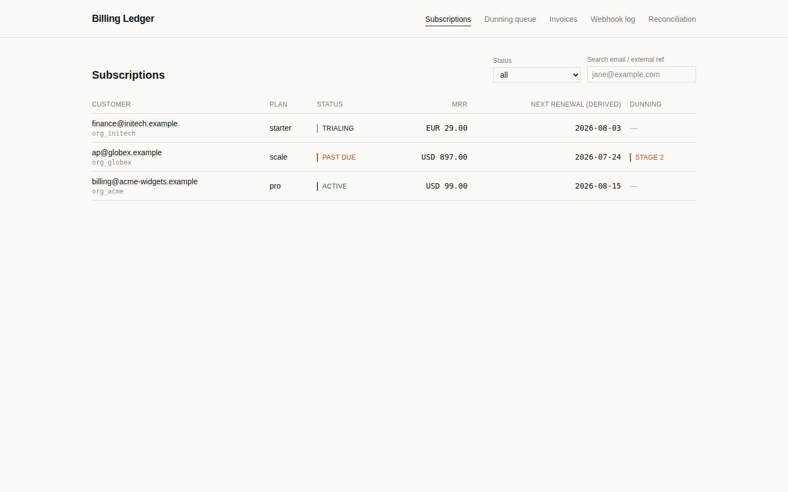
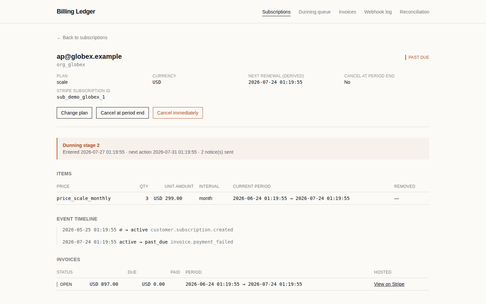
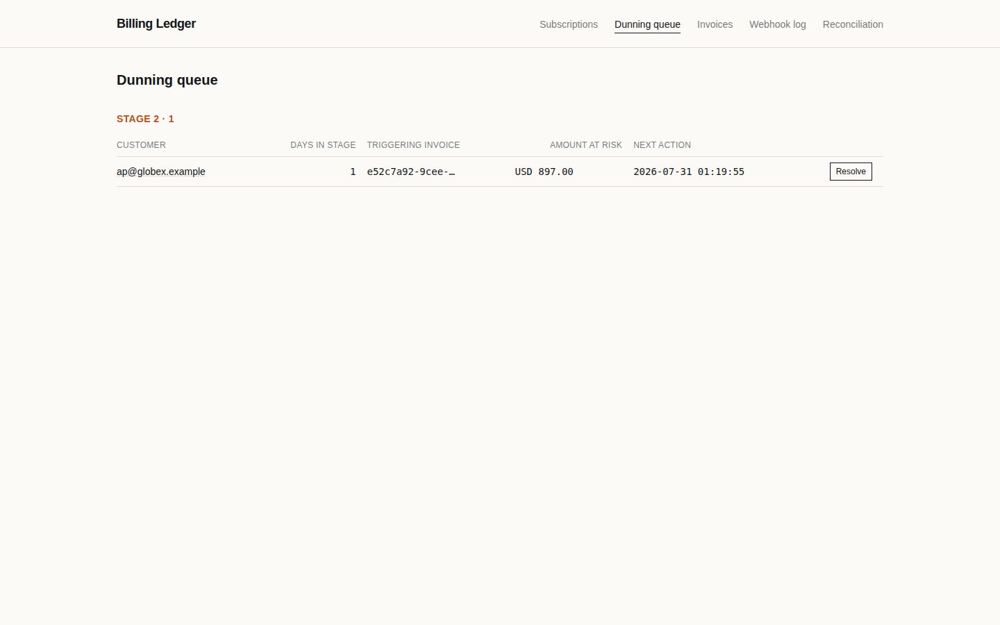
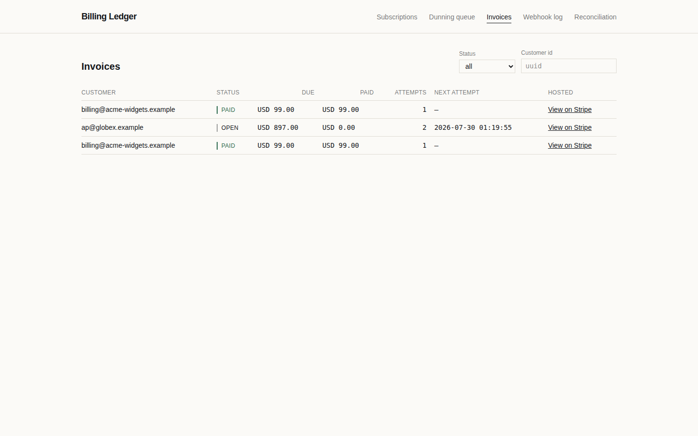
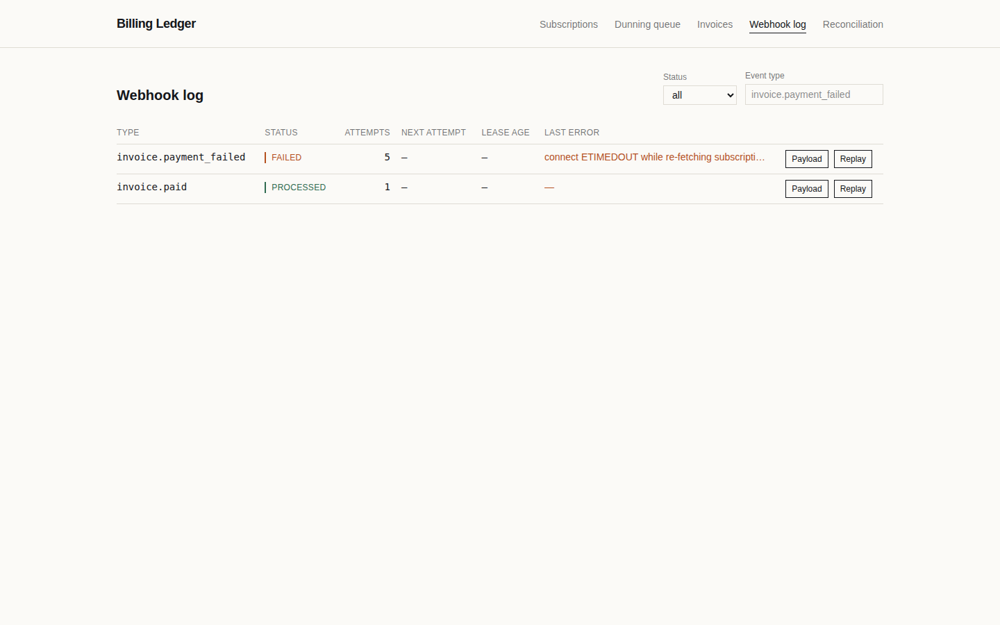
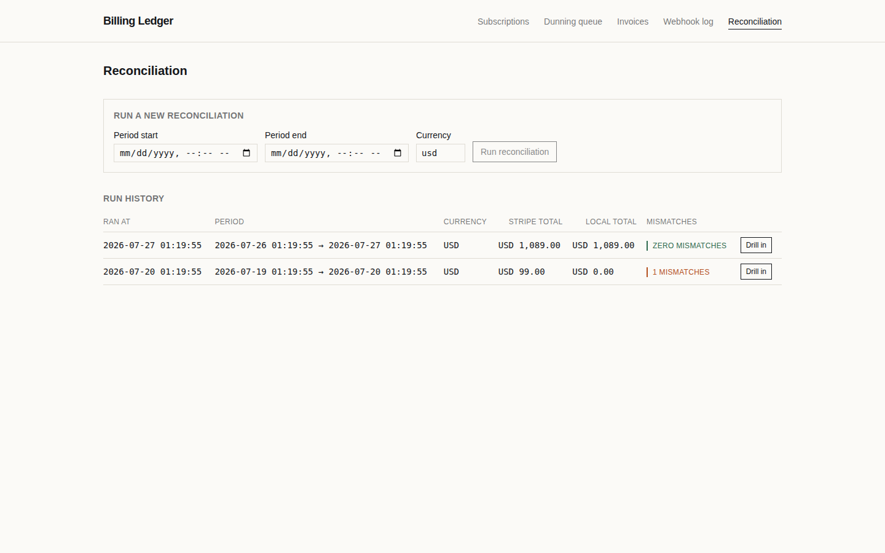

# Subscription Billing Kit

Stripe integrations break in a handful of predictable ways, and most of them fail silently — a 200 response with a field quietly `undefined`, a duplicate webhook nobody notices, a reconciliation that only checks totals and misses a missing invoice and an extra one of equal value canceling each other out. This service closes each one and proves it with a named test.

## The failure modes this closes

Every row here is a real, specific way a Stripe integration goes wrong in production — not a hypothetical. Each links to the test that fails if the fix ever regresses.

| Failure mode | How it's closed | Enforced by |
|---|---|---|
| Stripe's Basil release (2025-03-31) moved billing periods off the `Subscription` object onto its items — old code reading `subscription.current_period_end` gets a silent `undefined`, not an error | Periods are read and stored per subscription item, never off the subscription; the subscription's own "next renewal" is explicitly labelled *derived* everywhere it's shown | [`subscriptionProjection.test.ts`](api/test/integration/subscriptionProjection.test.ts) — periods-are-read-from-items, mixed-interval-subscription-stores-a-period-per-item |
| Parsing the webhook body as JSON before verifying its signature — works in dev, breaks on the first payload with a character that doesn't round-trip through `JSON.stringify` | Signature verification runs against the raw, unparsed request buffer, on a content-type parser scoped to the webhook route only | [`webhookNonAscii.test.ts`](api/test/integration/webhookNonAscii.test.ts), [`webhookReceiver.test.ts`](api/test/integration/webhookReceiver.test.ts) |
| Acknowledging a webhook before its data is actually durable — a database outage during the ack window loses the event permanently, because Stripe believes it was delivered | The receiver returns 200 *only after* the insert commits; a persist failure returns 500 so Stripe retries instead of believing a lie | [`webhookDbDown.test.ts`](api/test/integration/webhookDbDown.test.ts) |
| Stripe redelivers events — at least once, sometimes dozens of times for the same event | `stripe_event_id` is the primary key on the ledger table; replaying the same event 100 times leaves exactly one row | [`webhookReceiver.test.ts`](api/test/integration/webhookReceiver.test.ts) |
| Webhooks don't arrive in order — a stale "created" event arriving after a newer "canceled" one can revert real state if applied naively | Every event re-fetches current truth from the Stripe API rather than trusting its payload, and a staleness guard skips anything older than the last event actually applied | [`subscriptionProjection.test.ts`](api/test/integration/subscriptionProjection.test.ts) — out-of-order and late-arrival cases |
| A worker crashes mid-event (a deploy, an OOM kill) — the event is claimed but never finishes, and nothing ever picks it back up | A lease-based reaper reclaims any row stuck `processing` past its lease window and returns it to the queue | [`reaperRecovery.test.ts`](api/test/integration/reaperRecovery.test.ts) |
| A network timeout on a mutating Stripe call, followed by a naive retry, creates a second Stripe object — for a subscription, that's a duplicate charge | Every outbound mutating call carries a deterministic idempotency key built from one shared module, never constructed ad hoc at the call site | [`idempotency.test.ts`](api/test/unit/idempotency.test.ts), [`checkoutPortalPlanChange.test.ts`](api/test/integration/checkoutPortalPlanChange.test.ts) |
| Zero-decimal currencies (JPY, KRW, VND, and others) — Stripe's API amount *is* the whole unit, and code that divides by 100 to display it undercharges by 100× | A single money module keeps the zero-decimal set and is the only place the API scales any amount; nothing else in the backend divides or multiplies by 100 (the admin UI keeps its own small display-only mirror — see D-030) | [`money.test.ts`](api/test/unit/money.test.ts) |
| Summing amounts across currencies produces a number that means nothing — $5 + ¥500 has no correct answer | Currency-mismatched sums throw instead of silently coercing; every total in this codebase, including reconciliation, is per-currency | [`money.test.ts`](api/test/unit/money.test.ts) |
| Stripe timestamps are Unix seconds, not milliseconds — a stray ×1000 or ÷1000 produces a date in the year 55000 or 1970 | One conversion module, both directions covered, plus a canary test that would fail loudly if the scale were ever off | [`time.test.ts`](api/test/unit/time.test.ts) |
| An unrelated invoice being paid accidentally clears a real delinquency on a different subscription | Dunning resolution is keyed to the *specific* invoice that opened the cycle, not any payment from that customer | [`dunning.test.ts`](api/test/integration/dunning.test.ts) — paying-an-unrelated-invoice |
| A crash between writing a dunning notice and confirming it sent risks either a lost notice or a duplicate email on the next tick | Escalating a stage and sending its notice are two separable steps enforced by a database-level unique constraint — a crash in between is recovered exactly once, never twice | [`dunning.test.ts`](api/test/integration/dunning.test.ts) — crash-between-notice-write-and-send |
| Reconciliation that only compares totals hides the case that matters most: a missing invoice and an extra one of equal value net to zero | Every invoice is individually classified — `field_drift`, `missing_local`, or `orphan_local` — never just summed | [`reconcile.test.ts`](api/test/unit/reconcile.test.ts), [`reconciliation.test.ts`](api/test/integration/reconciliation.test.ts) |
| A plan change applied without ever showing the customer (or the admin) the actual proration amount first | Every plan-change path previews first, and the amount the customer is shown is checked against the invoice Stripe actually issues, not just passed through on faith | [`checkoutPortalPlanChange.test.ts`](api/test/integration/checkoutPortalPlanChange.test.ts) — plan-change-preview-matches-the-invoice |

That first row is the one worth pausing on. It's a real, dated Stripe release that quietly broke every integration reading the old field — not a made-up scenario. Handling it, and proving it with a test, says more than a claim about experience.

The full list — including the state-machine, reconciliation-window, and one known-and-documented limitation around outbound idempotency's exact scope — lives in `docs/ARCHITECTURE.md` and `docs/DECISIONS.md`, with the reasoning behind every non-obvious choice, not just the choice itself.

## Screenshots

Ledger design, not a dashboard — dense rows, tabular-figure monospace for every amount and timestamp, status as a word plus a color rule rather than a badge. The subscription detail screen's event timeline is the one to look at first: it reads like a bank statement, one line per state transition.

| | |
|---|---|
|  Subscriptions list |  Subscription detail — the event timeline |
|  Dunning queue |  Invoices |
|  Webhook log |  Reconciliation |

## Non-goals

This service never touches raw card data, never renders a card form, and never stores a PAN. [Stripe Checkout](https://stripe.com/docs/payments/checkout) and the [Customer Portal](https://stripe.com/docs/customer-management) handle all of it.

## Setup

```
npm install
cp .env.example .env
# fill in .env — see docs/ARCHITECTURE.md §5.1 before setting STRIPE_API_VERSION, and
# docs/RUNBOOK.md before pointing STRIPE_WEBHOOK_SECRET at anything but stripe listen
npm run db:migrate
npm run seed:catalog          # Starter/Pro/Scale products+prices in Stripe test mode
npm run dev                   # API
npm run dev:web               # admin UI, separate terminal
stripe listen --forward-to localhost:3000/webhooks/stripe
```

`GET /health` reports Postgres connectivity, Stripe connectivity, and the pinned Stripe API version. See `docs/RUNBOOK.md` for deploying, the two webhook gotchas that cost the most time on any Stripe integration, and day-to-day operations (crons, replaying a failed event).

Every admin route requires a key (`ADMIN_API_KEY` for full access, `ADMIN_READONLY_KEY` for browse-only) — the admin UI prompts for one on first load. See `docs/DECISIONS.md` D-033.

## Testing

```
npm run test:unit --workspace=api          # fast, no external services — target under 30s
npm run test:integration --workspace=api   # real Postgres + a mocked Stripe client, no time budget
npm run test:unit:coverage --workspace=api
npm run test:integration:coverage --workspace=api
npm run test:web                           # admin UI: RTL + jsdom + msw
```

Every test is named after the specific failure it prevents (see the table above and the test files themselves) — 19 integration + 6 unit tests are named directly in the project brief's §9, plus additional tests covering the admin API surface, the admin UI's supporting routes, `/health`, and the admin UI itself.

**325 tests, all three suites green:** 112 api unit (~2.5s) + 179 api integration (~15s) + 34 web (~4s).

Coverage below is `%Lines` from `@vitest/coverage-v8`, run separately per api suite since they exercise different layers on purpose — unit tests cover pure logic in isolation (`money.ts`, `time.ts`, `stateMachine.ts`, `idempotency.ts`, `reconcile.ts`'s classifier, `adminAuth.ts`'s role resolution), while routes, webhook handlers, and the processor/reaper are deliberately only exercised through the integration suite against a real database, per the test-plan split in `docs/ARCHITECTURE.md`. Reading the unit number on its own understates coverage for exactly that reason — the two numbers answer different questions, not the same question twice. (The web suite has no separate coverage tooling wired up — its 34 tests are behavior tests against the six admin screens and `lib/api.ts`, not tracked for line coverage.)

| Suite | Statements | Branches | Functions | Lines |
|---|---|---|---|---|
| Unit only | 19.56% | 12.9% | 30.28% | 19.95% |
| Integration only | 85.58% | 78.89% | 81.71% | 86.49% |

The remaining uncovered lines are almost entirely process bootstrapping that isn't meaningful to unit-test in isolation: `index.ts` (excluded from the report entirely), `webhooks/worker.ts`'s `setInterval` wiring, and `db/migrate.ts`'s CLI entry point.

## Stack

Node 20 + TypeScript (strict), Fastify, Zod, Postgres via `pg` and Drizzle, Stripe's Node SDK pinned to an explicit API version, Vitest for both test suites. The admin UI is React + Vite + Tailwind + react-router-dom. See `docs/ARCHITECTURE.md` for why each of these, where it mattered.

## Repo layout

```
/api       Fastify service — db/, stripe/, webhooks/, billing/, routes/, lib/
/web       React admin UI (Phase 7)
/docs      ARCHITECTURE, DECISIONS, RUNBOOK, STATE-MACHINE, DELIVERY, screenshots
/scripts   seed-catalog, dunning-tick, reconcile-nightly, test-clock, test-clock-demo, replay-event, smoke-test
PROGRESS.md   phase-by-phase build log and decision history
```

## License

MIT — see `LICENSE`.
